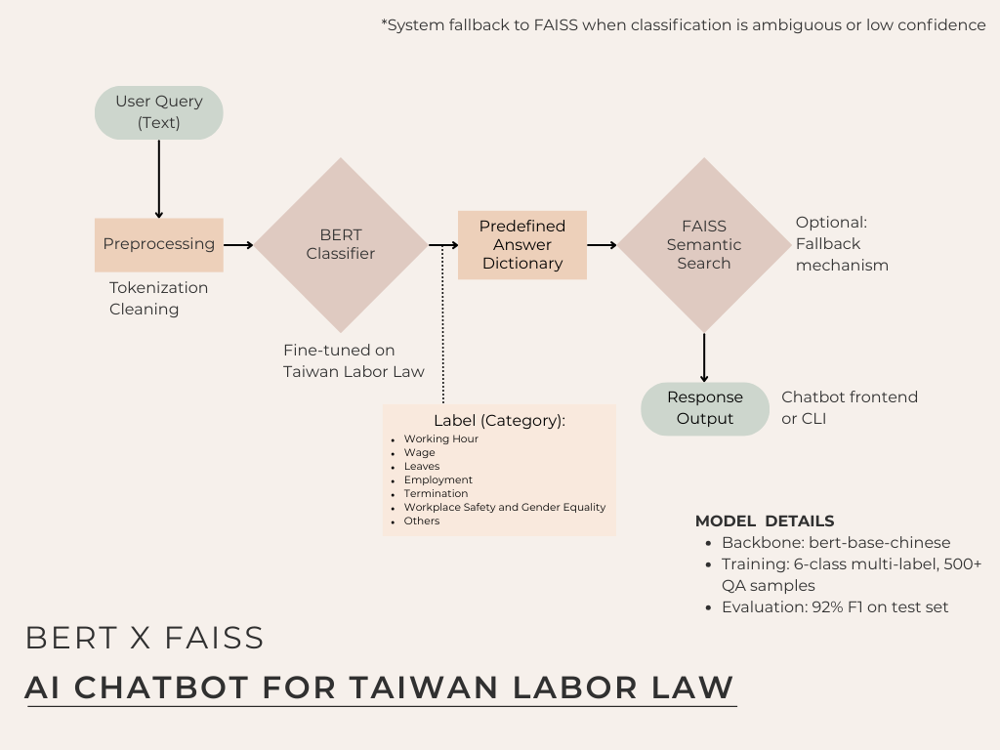

This project was part of my journey toward building fair, human-centered AI for workplace transformation.

## Taiwan Labor Law Chatbot (RAG vs Fine-tuned)

This project implements and evaluates two backend architectures for a chatbot designed to answer questions related to Taiwan's Labor Standards Act:

* A fine-tuned RoBERTa model for legal clause classification
* A GPT-4 + FAISS-based retrieval-augmented generation (RAG) system

Both models are compared in terms of accuracy, response reliability, and production-readiness.

---

### 🔍 Why this project matters

Many employees and recruiters struggle to interpret Taiwan's labor laws. This project demonstrates how large language models (LLMs) can reduce barriers to legal knowledge by combining classification and retrieval techniques to provide accurate, accessible answers.

By fine-tuning BERT on categorized legal clauses and comparing it with RAG-style retrieval, this chatbot offers a low-resource solution for improving legal literacy and fairness in the workplace.

---

### 📄 System Overview

* **User Input** → Inference pipeline
* **Option 1:** RoBERTa classifier (5 legal categories) → Predefined response
* **Option 2:** GPT-4 + FAISS vector search → Top-1 semantic match + GPT response
* CLI-based demo provided for both architectures

---

### 🧪 Model Comparison

| Model               | Accuracy |
| ------------------- | -------- |
| Fine-tuned RoBERTa  | 90%      |
| GPT-4 + FAISS (RAG) | 18%      |

**Insights:**

* Fine-tuned models show high consistency and precision for domain-specific classification tasks
* RAG pipelines underperform in legal QA due to ambiguous phrasing and semantic similarity limitations

---

### 🔧 Key Features

* Binary evaluation (correct/incorrect) on 50 manually labeled test questions
* Confidence score output for RoBERTa predictions
* Keyword-boosted FAISS retrieval for edge-case handling
* Modular architecture for easy extension to other legal domains

---

### 🔄 Suggested Deployment Architecture

* Use fine-tuned BERT (or RoBERTa) as the **routing classifier**
* Use GPT (e.g. GPT-4) for **response generation** after classification
* Explore multi-task learning (classification + generation) in future iterations

---

### 📦 Resources

* [GitHub Repository](https://github.com/HUEI-JYUN-DEBBY-YEH/AI_Chatbot)
* [BERT Fine-tune Project](https://github.com/HUEI-JYUN-DEBBY-YEH/bert-fine-tune-taiwan-labor-law)
* [Medium Article](https://medium.com/@debby.yeh1994/%E6%89%93%E9%80%A0%E5%8F%B0%E7%81%A3%E5%8B%9E%E5%9F%BA%E6%B3%95-chatbot-%E5%BE%9E-bert-%E5%BE%AE%E8%AA%BF%E5%88%B0%E6%99%BA%E8%83%BD%E5%95%8F%E7%AD%94%E6%95%B4%E5%90%88-39180677eef1)
* [Portfolio Summary on Notion](https://mango-mapusaurus-5df.notion.site/debby-yeh-portfolio?pvs=4)

---

### 👤 Author

**@HUEI-JYUN-DEBBY-YEH**
NLP Application Engineer in Training
Focus: LLMs, vector search, chatbot deployment, multimodal pipeline, Flask API

---

### ✅ Conclusion

For high-precision domains like legal QA, fine-tuned classification models significantly outperform retrieval-based methods. A hybrid architecture—classification for routing, generation for fluency—is recommended for production scenarios where accuracy and clarity are paramount.
